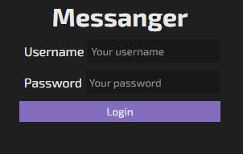
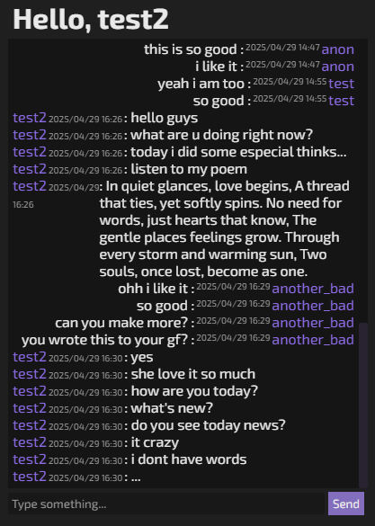

# 💬 Message App — Starter Template for Beginners

This is a **beginner-friendly source code** for a simple messaging web application. It includes login functionality, local message saving, and basic UI styles using HTML, CSS, and JavaScript — perfect as a foundation for learning and extending chat-based interfaces.

## 🎴 Preview




## 📁 Project Structure

```
message-app/
├── login.html           # Login page
├── main.html            # Chat page after login
├── styles.css           # All styles and theme variables
├── login.js             # Logic for authentication
├── main.js              # Logic for message handling
```

## ⚙️ Features

- 🔐 Simple login form (username & password)
- 💾 LocalStorage-based user and message saving
- 🗨️ Dynamic chat message display
- 🎨 Clean and customizable UI with CSS variables
- 🔄 Persistent login and message history

## 🚀 How to Run

1. Clone the repository:
   ```bash
   git clone https://github.com/your-username/message-app.git
   cd message-app
   ```

2. Open `index.html` in your browser.

3. Register or log in with a username and password.

4. Start sending messages!

> 🧠 Note: This is a frontend-only project using LocalStorage — no server-side logic or database included. Ideal for practice or further development.

## 📚 For Beginners

This codebase was created as a **starter template for everyone starting out in web development**. You can:

- Add backend support (e.g., Firebase, Express.js)
- Improve styles (maybe Tailwind or Bootstrap?)
- Add user avatars, timestamps, or emojis 🎉

## 🤝 Contributing

Pull requests are welcome! Feel free to fork the project and improve it in your own style.

## 📜 License

MIT License © 2025

---

Made with ❤️ to help you **learn by building**.

By **d3cryptex**
